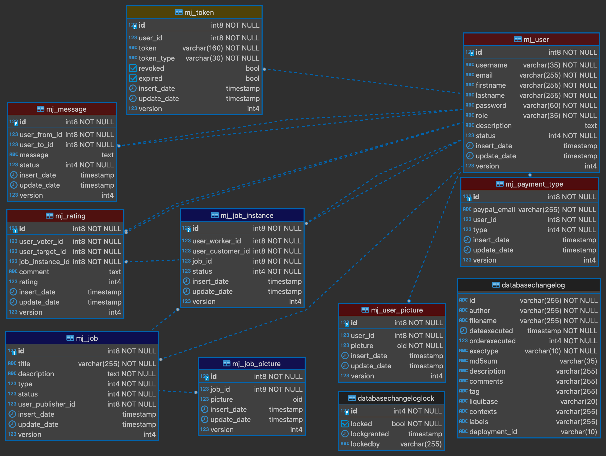

# MicroJobs

Micro Jobs is a small platform that allows users to offer or to request services in return for money.

# Technologies
- Java;
- Spring Boot (... +Spring Security);
- ModelMapper;
- Hibernate;
- Spring JPA;
- Liquibase;
- PostgreSQL;
- Gradle;
- Git.

# Features
- user login (JWT)
- user logout
- user registration
- refresh token
- view requests/offers
- insert requests/offers
- picture upload
- ...wip

# Architecture

If you want to get some information, feel free to [contact me](http://andre-i.eu/#contactme).
